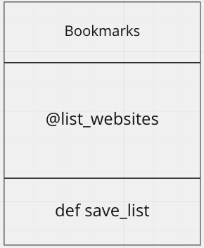

# Bookmark Manager

# Intructions

-- User Stories --
As a user,
so I can see the bookmarks that I've saved,
I would like to see a list of bookmarks.

# Create DATABASE
- In order to build a database we run CREATE DATABASE routine in psql environment, called bookmark_manager.
- We build a table within bookmark_manager database, called bookmarks.
- In order to keep a record of sql routines we create a folder and sub-folder called db and migrations, respectively.

